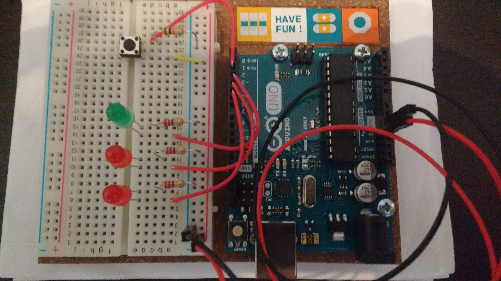

#######
Arduino
#######

Proyectos de arduino starter kit
================================

Información completa de los proyectos en `la página oficial <https://www.arduino.cc/en/Main/ArduinoStarterKit>`_

Proyecto 2: Nave espacial
~~~~~~~~~~~~~~~~~~~~~~~~~

Este proyecto consiste en configurar las clavijas 3,4 y 5 como salidas que encenderán tres leds y la clavija 2 como entrada que recogerá la señal del pulsador.

Por defecto estará encendido el led verde. Cuando se accione el pulsador, se apagará el led verde, se encenderán y apagaran los leds rojos y se volverá a encender el led verde.

Ha continuación se muestra el código:

.. literalinclude:: media/arduino/02_spaceship_interface.ino

Proyecto 3: Termómetro
~~~~~~~~~~~~~~~~~~~~~~

En construcción.
